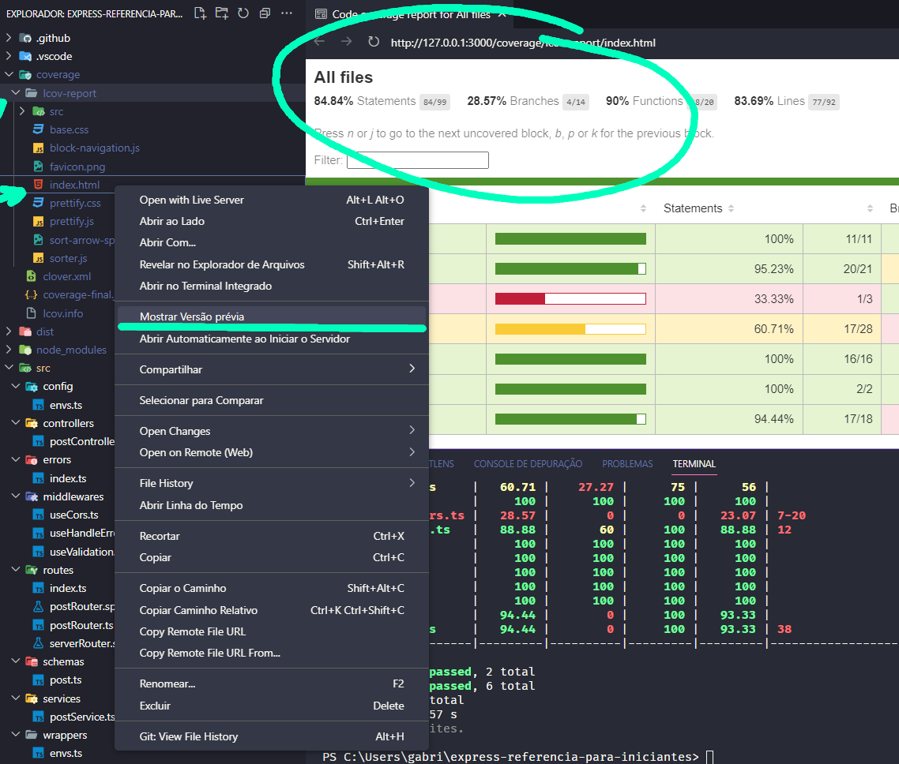

# Introdução

Este é uma referência básica para novatos no typescript com express, tendo inumeras partes simplificadas e com comentários

ESSE REPOSITÓRIO CONTÉM ERROS DE FORMA PROPOSITAL, é uma referência para testes!

## Como executar?

Você precisa de ter o node 16 instalado.

Instale o yarn

```bash
npm i --global yarn
```

Instale os pacotes

```bash
yarn
```
Então execute aplicação

```bash
yarn dev
```

## Algumas recomendações de extensões para você instalar no seu vscode

- Thunder Client
- REST Client
- Reload
- Prettier ESLint
- Prettier - Code formatter
- Portuguese (Brazil) Language Pack for Vi
- Material Icon Theme
- Live Server
- Live Preview
- IntelliCode Api Usage Examples
- IntelliCode
- Import Cost
- GitLens - Git supercharged
- gitignore
- Git History
- ESLint
- EditorConfig for VS Code
- Dracula Official
- Console Ninja
- Color Highlight
- CodeMetrics
- Code Spell Checker

## Alguns comandos

- Instalar os pacotes `yarn`
- Iniciar a api no modo dev `yarn dev`
- executar os testes `yarn jest`
- executar os testes e ficar escutando alterações `yarn jest --watchAll`
- executar os testes e gerar cobertura de testes `yarn jest --coverage`

Você pode ver a cobertura de testes na pasta coverage, ou na propria cli




in chrome dev tools
document.designMode = 'on'

// dica clonar só um nivel de commits

git clone https://github.com/jestjs/jest  --dept=1
